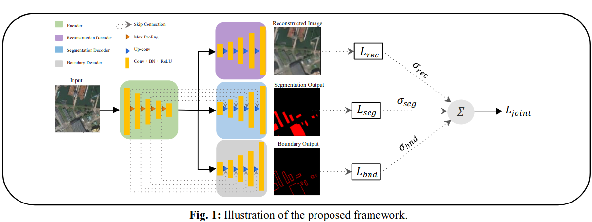
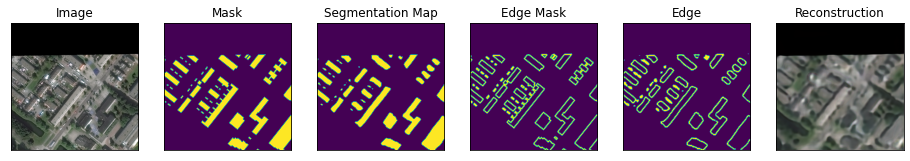
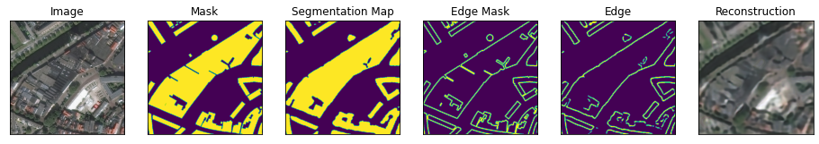
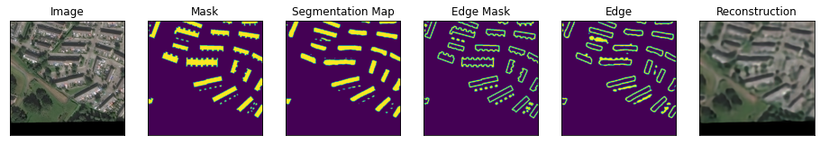
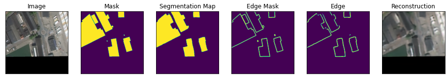

# Land Use and Land Cover Mapping Using Deep Learning Based Segmentation Approaches and VHR Worldview-3 images
This repository contains the code for the paper [A MULTI-TASK DEEP LEARNING FRAMEWORK FOR BUILDING FOOTPRINT SEGMENTATION](https://ieeexplore.ieee.org/document/9554766). 

Framework
---------------------
- This works constructs a multi-task learning framework in which the main segmentation task is coupled with the auxilliary image reconstruction and edge extraction tasks. A homoscedastic uncertainty aware-objective function is formed where individual loss contributions are learned throughout the training procedure, along with the default weights.   

Outputs
---------------------
Sample outputs, from left to right: 
- Input Image,
- Segmentation Annotation,
- Predicted Segmentation Annotation,
- Edge Annotation,
- Predicted Edge Annotation,
- Reconstructed Input Image.

How to use it?
---------------------

Simply download the repository and follow the *main_notebook.ipynb* after modifying the paths and the parameters in the *params.py* script.

The [Spacenet6](https://arxiv.org/abs/2004.06500) dataset needs to be downloaded prior to running the main notebook (or use your own custom Dataset instance).

The code was implemented in Python(3.8) and PyTroch(1.14.0) on Windows OS. The *segmentation models pytorch* library is used as a baseline for implementation. Apart from main data science libraries, RS-specific libraries such as GDAL, rasterio, and tifffile are also required.

Citation
---------------------

B. Ekim and E. Sertel, "A Multi-Task Deep Learning Framework for Building Footprint Segmentation," 2021 IEEE International Geoscience and Remote Sensing Symposium IGARSS, 2021, pp. 2500-2503, doi: 10.1109/IGARSS47720.2021.9554766.

Contact Information:
--------------------

If you encounter bugs while using this code, please do not hesitate to contact me.

Burak Ekim: burak.ekim@unibw.de  
